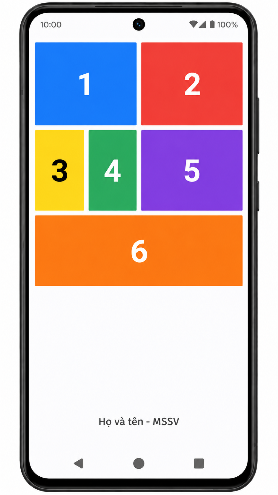

# Bài 01: Giao diện 6 ô màu (Flutter)

## Yêu cầu đề bài

Dựng lại giao diện gồm 6 ô màu đánh số từ 1 đến 6 bằng `Row`, `Column` và `Expanded`. Bên dưới là dòng họ tên và MSSV.



Bố cục (từ trên xuống):

- **Hàng 1:** ô 1 (xanh dương) và ô 2 (đỏ), rộng bằng nhau.
- **Hàng 2:** nửa trái là một `Row` lồng chứa ô 3 (vàng, số đen) và ô 4 (xanh lá), nửa phải là ô 5 (tím). Nhờ `Row` lồng nên mép phải ô 4 thẳng hàng với mép phải ô 1.
- **Hàng 3:** ô 6 (cam) full width.
- Dòng `Tran Manh Danh - BIT240053` được `Spacer` đẩy xuống đáy màn hình.

Điểm tùy chỉnh so với ảnh mẫu (theo code trong `src/lib/main.dart`):

- Thay dòng "Họ và tên - MSSV" bằng họ tên và MSSV thật: `Tran Manh Danh - BIT240053`.
- Vì app chạy trên trình duyệt desktop, nội dung được bọc trong `ConstrainedBox(maxWidth: 430)` để giữ tỉ lệ như điện thoại, không bị kéo giãn theo cửa sổ.
- Chiều cao mỗi hàng tính theo chiều cao màn hình (`MediaQuery`): hàng 1 ≈ 19%, hàng 2 ≈ 18.5%, hàng 3 ≈ 16%.
- Mỗi ô là một widget `ColorBox` dùng lại được (tham số `label`, `color`, `textColor`), bo góc 2, khoảng cách giữa các ô dùng chung hằng số `gap = 8`.

## Công nghệ

- Flutter 3.47.5 (channel stable), Dart 3.13.4
- Nền tảng chạy: web (trình duyệt Chrome hoặc trình duyệt nhân Chromium)

## Cách chạy

Yêu cầu: đã cài Flutter SDK và có Chrome. Nếu dùng trình duyệt Chromium khác (ví dụ Cốc Cốc), đặt biến `CHROME_EXECUTABLE` trỏ tới file `.exe` của trình duyệt đó.

```bash
cd bai-01/src && flutter pub get && flutter run -d chrome
```

Chạy kiểm tra:

```bash
flutter analyze
flutter test
```

## Ảnh giao diện chính


## Video demo

[Xem video demo](https://drive.google.com/file/d/14sLkrXrd8r2ldRuQTxRr7wbSSZ-0XA_-/view?usp=drive_link)
