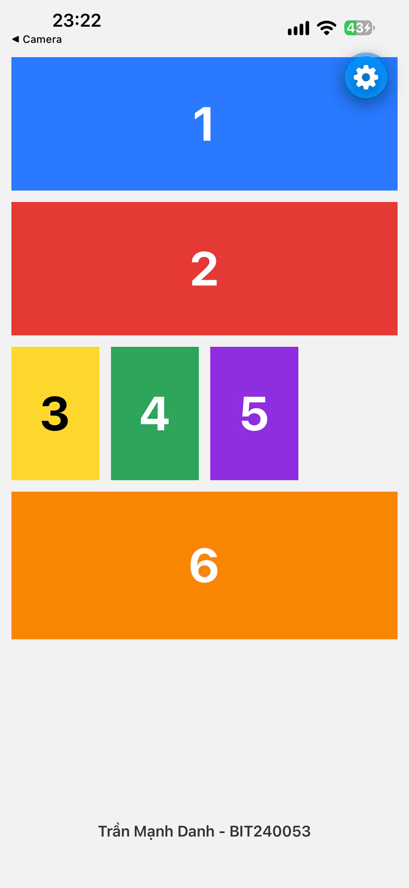

# Bài 02: Giao diện 6 ô màu

## Yêu cầu đề bài

Sử dụng React Native để lập trình giao diện gồm 6 ô màu.

## Công nghệ dùng

- Expo (~57.0.24) + Expo Router
- React Native 0.86.3
- React 19.2.3
- TypeScript

## Cách chạy

```bash
cd src
npm install
npm run start   # hoặc: npm run android / npm run ios / npm run web
```

Màn hình chính nằm ở `src/src/app/index.tsx`.

## Ảnh giao diện chính



## Video demo

[Xem video demo](https://drive.google.com/file/d/1aKNCUqSAgx41VEyIuwFRsY3VUK3MagNn/view?usp=drive_link)
