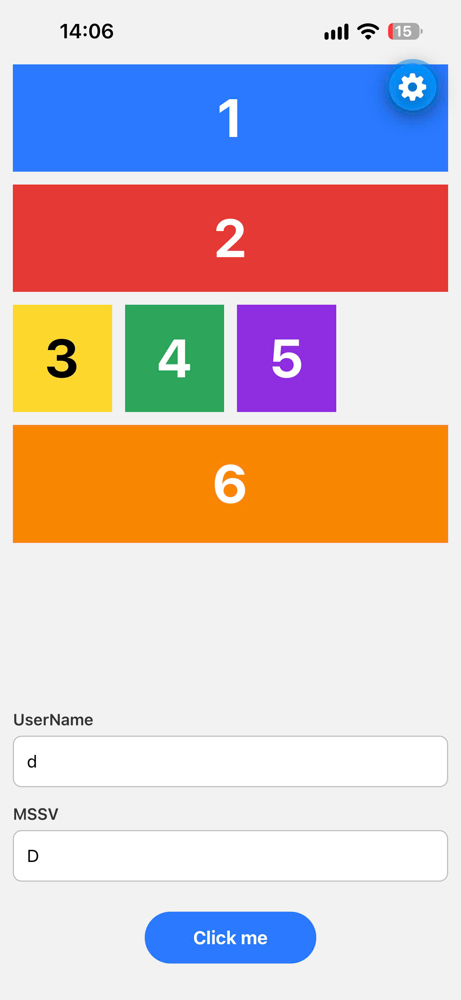
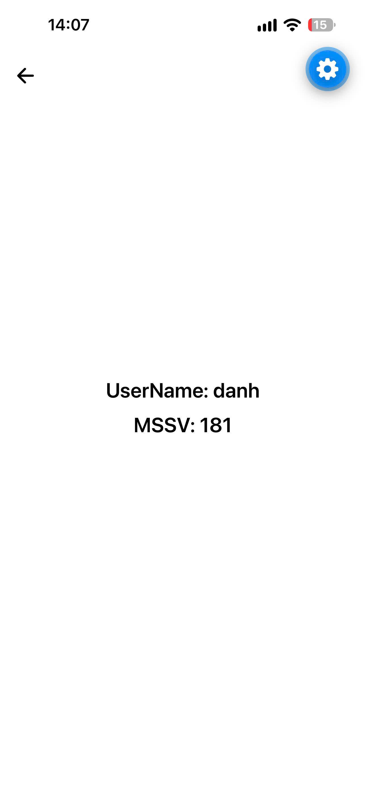

# Bài 03: Điều hướng và truyền dữ liệu giữa 2 màn hình (React Native)

## Yêu cầu đề bài

Kế thừa giao diện 6 ô màu của bài 02, bổ sung:

1. **Điều hướng 2 màn hình:** Screen 1 có nút **"Click me"** ở bottom-center, bấm vào thì chuyển sang Screen 2. Screen 2 có nút **icon mũi tên quay lại** màu đen ở góc top-left, bấm vào thì quay về Screen 1.
2. **Truyền dữ liệu có validate:** Screen 1 có 2 ô nhập **UserName** và **MSSV**, không được để trống. Nếu hợp lệ thì truyền dữ liệu sang Screen 2 và hiển thị cả 2 giá trị ở giữa màn hình.

## Công nghệ và thư viện

Lấy từ `src/package.json` (version thực tế đã cài trong `node_modules` ghi trong ngoặc):

| Thư viện | Version khai báo | Vai trò |
|----------|------------------|---------|
| `expo` | ~57.0.24 (57.0.24) | Expo SDK 57 |
| `expo-router` | ~57.0.22 (57.0.22) | **Điều hướng** file-based (Stack), truyền dữ liệu qua route params |
| `react-native-screens` | ~4.26.0 (4.26.2) | Native stack screens (expo-router dùng bên dưới) |
| `react-native-safe-area-context` | ~5.7.0 (5.7.0) | Tránh tai thỏ / thanh home |
| `@expo/vector-icons` | ^15.0.2 (15.1.1) | Icon `Ionicons arrow-back` cho nút quay lại |
| `react-native` | 0.86.3 | |
| `react` | 19.2.3 | |
| `typescript` | ~6.0.3 | |

Cơ chế điều hướng:

- `_layout.tsx` dùng `<Stack screenOptions={{ headerShown: false }} />` của `expo-router`.
- Screen 1 → Screen 2: `router.push({ pathname: '/screen2', params: { userName, mssv } })`.
- Screen 2 nhận dữ liệu bằng `useLocalSearchParams()`, quay lại bằng `router.back()` (nếu không có lịch sử thì `router.replace('/')`).

## Cấu trúc thư mục chính

```
bai-03/
├── src/                          # project Expo
│   ├── package.json
│   ├── app.json
│   └── src/
│       ├── app/                  # routes (expo-router)
│       │   ├── _layout.tsx       # Stack navigator, ẩn header
│       │   ├── index.tsx         # route "/"        -> Screen1
│       │   └── screen2.tsx       # route "/screen2" -> Screen2
│       └── screens/
│           ├── Screen1.tsx       # 6 ô màu + form UserName/MSSV + nút "Click me"
│           └── Screen2.tsx       # nút back + hiển thị UserName/MSSV
├── screenshots/
└── README.md
```

## Cách chạy

Yêu cầu: Node.js (đã thử với Node v24.21.0, npm 11.19.0), app **Expo Go** trên điện thoại.

```bash
cd src
npm install
npx expo start          # quét QR bằng Expo Go (điện thoại cùng Wi-Fi với máy tính)
npx expo start --tunnel # nếu điện thoại không kết nối được qua LAN
npx expo start --web    # chạy trên trình duyệt
```

Đã chạy thử: `npx tsc --noEmit` không lỗi, `npx expo start` khởi động Metro thành công, `npx expo export --platform ios` bundle thành công.

## Cách validate hoạt động

Logic nằm trong `handleClick` của `src/src/screens/Screen1.tsx`:

1. Lấy giá trị 2 ô và `trim()` (chỉ nhập dấu cách cũng tính là trống).
2. Ô nào trống thì viền ô chuyển đỏ và hiện lỗi ngay dưới ô: *"Vui lòng nhập UserName"* / *"Vui lòng nhập MSSV"*.
3. Nếu còn lỗi thì **không** chuyển màn hình.
4. Gõ lại vào ô đang lỗi thì lỗi của ô đó tự xóa.
5. Hợp lệ thì truyền giá trị đã trim sang Screen 2 qua route params. Bấm "done" trên bàn phím ở ô MSSV cũng submit giống nút "Click me".

## Ảnh giao diện

**Màn hình chính (Screen 1)** - đã nhập UserName và MSSV:



**Screen 1 báo lỗi** - bấm "Click me" khi để trống cả 2 ô:


**Screen 2** - hiển thị UserName và MSSV nhận từ Screen 1, nút quay lại ở góc trên trái:



## Video demo

[Xem video demo](https://drive.google.com/file/d/1bjOUZkwsC_RbP81QFbOKimqP4hrPT65J/view?usp=sharing)
